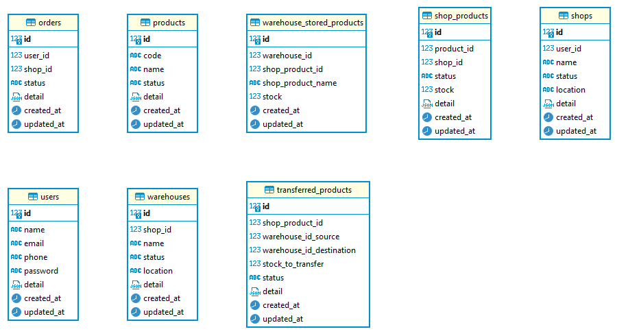

# SIMCOMM-MONOLITH (Simple Ecommerce)
A monolithic system for initializing ecommerce business

# How To Run
- make docs : generate swagger docs
- make run : run service
  - prepare redis and posgresql
  - adjust config.yaml
- make test : run unit test

# Design
- 
- 
- 
- 